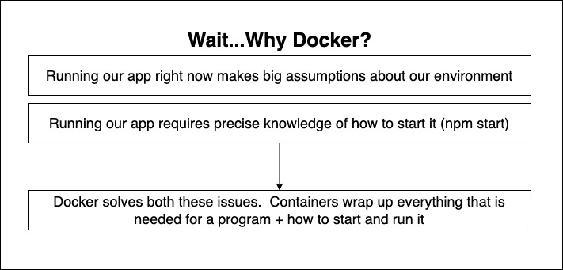
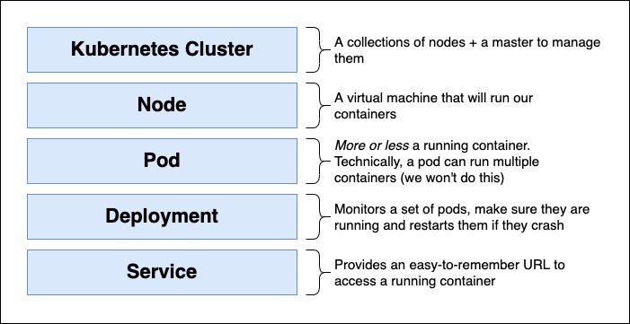

# Event-Based Architecture? Covered! Server side rendering with React? Yep.  Scalable, production-ready code? Its here!

> Microservices are the number one solution for building and scaling out apps that are intended to grow.

## What Technology You'll Use

Because we are building a full stack application, we will use a variety of technologies. On the frontend, we'll use React and `Next JS` to present content to users. Each service is created using `Node` and `Express`. Data for each service is held in either a Mongo database or Redis. The entire app is deployed and runs in `Docker` containers executed in a `Kubernetes` cluster.

## What You'll Learn

An absolute incredible number of topics are covered in this course.  Here is a partial list of what you'll do:
 - Practice patterns to create scalable microservices for a variety of app domains
 - Deploy a multi-service app to the cloud with Docker and Kubernetes
 - Write a custom implementation of an event bus
 - See best practices in communication between different services
 - Configure and scale your services using Kubernetes Deployments
 - Document and enforce structure constraints on events shared across microservices

## Docker

Docker is an open platform for developing, shipping, and running applications. Docker enables you to separate your applications from your infrastructure so you can deliver software quickly.

With Docker, you can manage your infrastructure in the same ways you manage your applications.

### Why Docker

### Docker Commands

 - `docker build -t <image-name> .` - Build an image from a Dockerfile
 - `docker run -p <host-port>:<container-port> <image-name>` - Run a container from an image
 - `docker ps` - List running containers
 - `docker exec -it <container-id> sh` - Run a command in a running container
 - `docker logs <container-id>` - Get logs from a container
 - `docker stop <container-id>` - Stop a running container
 - `docker rm <container-id>` - Remove a container
 - `docker rmi <image-id>` - Remove an image
  

### Dockerfile

## Kubernetes

`Kubernetes`, also known as `K8s`, is an open-source system for automating deployment, scaling, and management of containerized applications.

### Why Kubernetes

### Kubernetes Terminologies

 - `Pod` - A group of one or more containers, with shared storage/network, and a specification for how to run the containers.
 - `Node` - A worker machine in Kubernetes, previously known as a `minion`. A node may be a VM or physical machine, depending on the cluster. Each node contains the services necessary to run pods and is managed by the master components.
 - `Cluster` - A set of nodes that run containerized applications managed by Kubernetes.
 - `Deployment` - A Kubernetes object that manages a replicated application.
 - `Service` - An abstract way to expose an application running on a set of Pods as a network service.
 - `Ingress` - A collection of rules that allow inbound connections to reach the cluster services.
 - `Namespace` - A way to divide cluster resources between multiple users.
 - `Label` - A key/value pair that is attached to objects, such as pods. Labels are intended to be used to specify identifying attributes of objects that are meaningful and relevant to users, but do not directly imply semantics to the core system.
 - `Selector` - A label query over a set of resources. The result of matchLabels and matchExpressions are ANDed. An empty label selector matches all objects. A null label selector matches no objects.
 - `ReplicaSet` - The next-generation Replication Controller. The ReplicaSet controller is now the recommended way to set up replication for your application.
 - `PersistentVolume` - A piece of storage in the cluster that has been provisioned by an administrator. It is a resource in the cluster just like a node is a cluster resource.
 - `PersistentVolumeClaim` - A request for storage by a user. It is similar to a pod. Pods consume node resources and PVCs consume PV resources.
 - `Secret` - A piece of sensitive data that you want to store in Kubernetes. Secrets are stored in Kubernetes as plaintext, so you should use them only for sensitive data that you want to encrypt.
 - `ConfigMap` - A way to inject configuration data into pods. ConfigMaps are stored in Kubernetes as plaintext, so you should use them only for non-sensitive data.
 - `Job` - A Kubernetes object that runs a pod to completion.
 - `DaemonSet` - A Kubernetes object that ensures that all (or some) nodes run a copy of a pod.
 - `StatefulSet` - A Kubernetes object that manages the deployment and scaling of a set of

### Kubernetes Config Files
)

## React.js

## Next.js

## Node.js

## Express

